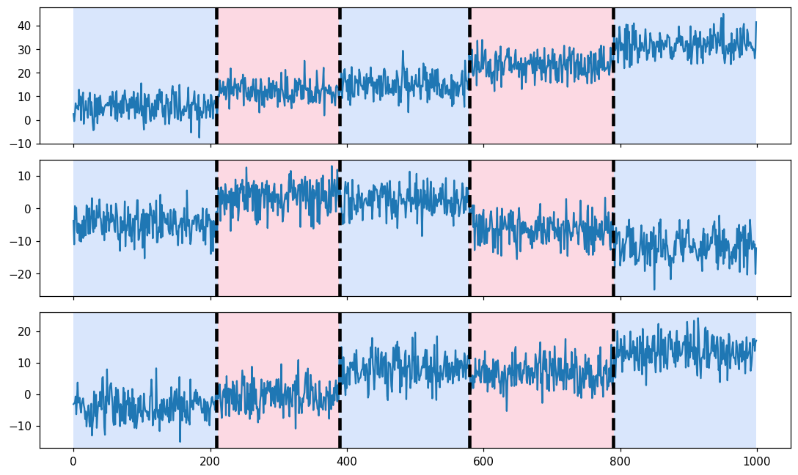

# ruptures_lite

A **pure-source, zero-install** port of the excellent
[`ruptures`](https://centre-borelli.github.io/ruptures-docs/) change-point
detection library, built for **locked-down environments** (e.g. an old Anaconda
Python 3.8.3 install where you cannot `pip install` anything new).

It depends only on packages such an environment already has: **numpy, scipy,
pandas, scikit-learn**. There are **no compiled extensions and no build step** —
deployment is "copy the `ruptures_lite/` folder somewhere on `sys.path`".

It mirrors `ruptures` v1.1.10 closely enough that its breakpoint outputs are
**identical** (verified by a parity test suite that compares against the real
`ruptures`, see `tests/`). On top of that, it adds a **categorical/numeric
preprocessing layer** that `ruptures` does not have.

## Installation in a locked-down environment (no `pip`)

There is nothing to install and nothing to compile — you just need Python to
*find* the package. The repository looks like this:

```
ruptures_lite/            <- repo root (what you clone/download)
├── ruptures_lite/        <- the importable package (this is the folder that matters)
│   ├── __init__.py
│   ├── detection/ costs/ ...
├── tests/
└── README.md
```

The thing you `import` is the **inner** `ruptures_lite/` folder. To use it, the
folder that *contains* it must be on Python's import path. Pick whichever of
these fits your machine.

**First, get the files onto the target machine** (any one of these):

```bash
git clone https://github.com/doolingdavid/ruptures_lite.git
# or, with no git: download the ZIP from the GitHub "Code" button and unzip it,
# or scp/copy the folder over from another machine.
```

**Option A — copy the package next to your script (simplest).**
Copy just the inner `ruptures_lite/` package folder into the same directory as the
`.py` script or notebook you run. Python always searches the script's own
directory, so this just works:

```
my_project/
├── analysis.py
└── ruptures_lite/        <- the inner package folder, copied here
```
```python
# analysis.py
import ruptures_lite as rpt   # found automatically
```

**Option B — leave it anywhere and add it to `sys.path` at runtime.**
Put the line *before* the import. The path you add is the folder that *contains*
the inner package (i.e. the repo root), not the inner folder itself:

```python
import sys
sys.path.insert(0, "/home/you/code/ruptures_lite")   # repo root (holds the inner pkg)
import ruptures_lite as rpt
```

In a Jupyter notebook the same line works in the first cell.

**Option C — use the `PYTHONPATH` environment variable** (no code change):

```bash
export PYTHONPATH="/home/you/code/ruptures_lite:$PYTHONPATH"   # repo root
python analysis.py
```

On Windows: `set PYTHONPATH=C:\path\to\ruptures_lite;%PYTHONPATH%`.

**Verify it loaded:**

```python
import ruptures_lite as rpt
print(rpt.__version__, "mirrors ruptures", rpt.__ruptures_compat__)
```

> Note: this is a source-on-`sys.path` deployment, so `pip list` /
> `conda list` will **not** show `ruptures_lite` — that's expected and fine. The
> only requirement of the target environment is that `numpy`, `scipy`, `pandas`
> and `scikit-learn` are importable (matplotlib only if you call `display`).

## Basic usage

The canonical [`ruptures` homepage](https://centre-borelli.github.io/ruptures-docs/)
example works unchanged (apart from the import) — `ruptures_lite` ships the same
`pw_constant` generator, the `Pelt` estimator, and a `display` helper:

```python
import matplotlib.pyplot as plt
import ruptures_lite as rpt

# generate signal
n_samples, dim, sigma = 1000, 3, 4
n_bkps = 4  # number of breakpoints
signal, bkps = rpt.pw_constant(n_samples, dim, n_bkps, noise_std=sigma)

# detection
algo = rpt.Pelt(model="rbf").fit(signal)
result = algo.predict(pen=10)

# display
rpt.display(signal, bkps, result)
plt.show()
```



Shaded bands are the *true* regimes; dashed vertical lines are the *detected*
change points. (`display` is the only feature that needs matplotlib, and it is
imported lazily — the rest of the package runs without it.)

## Why this exists

`ruptures` ships Cython/C extensions (`ekcpd`, `convert_path_matrix`) that need a
compiler/build, which is a non-starter in a frozen environment. `ruptures_lite`
re-implements those two pieces in plain numpy and ports the rest of the
(already pure-Python) library verbatim.

## What's included

| Category | Items |
|---|---|
| Search methods | `Pelt`, `Dynp`, `Binseg`, `BottomUp`, `Window`, `KernelCPD` |
| Cost models | `l1`, `l2`, `normal`, `rbf`, `cosine`, `linear`, `clinear`, `mahalanobis`, `rank`, `ar` |
| Metrics | `precision_recall`, `hausdorff`, `randindex`, `hamming`, `meantime` |
| Datasets | `pw_constant`, `pw_normal`, `pw_wavy`, `pw_linear` |
| Display | `display` (matplotlib imported lazily; optional) |
| **Extra** | `FrameEncoder`, `prepare_signal`, `detect` (categorical-aware, DataFrame-first) |

## Drop-in usage (same API as ruptures)

```python
import ruptures_lite as rpt

algo = rpt.Pelt(model="l2", min_size=2, jump=5).fit(signal)   # signal: (n, d) ndarray
bkps = algo.predict(pen=10)

bkps = rpt.Dynp(model="rbf").fit_predict(signal, n_bkps=4)
bkps = rpt.KernelCPD(kernel="rbf").fit_predict(signal, n_bkps=4)
```

Existing `ruptures` code typically works after changing one line:
`import ruptures as rpt` -> `import ruptures_lite as rpt`.

## Extra: mixed numeric + categorical DataFrames

`ruptures` only accepts numeric arrays. `ruptures_lite` can take a
`pandas.DataFrame` with categorical columns and encode it for you (one-hot for
categoricals, z-score for numerics — both done with version-robust numpy/pandas
primitives, **not** `OneHotEncoder`, whose `sparse`/`sparse_output` kwarg differs
across scikit-learn versions).

```python
import ruptures_lite as rpt

res = rpt.detect(
    df,                 # DataFrame, optionally with a DatetimeIndex
    method="pelt",      # pelt | dynp | binseg | bottomup | window | kernelcpd
    model="l2",
    pen=None,           # if pen and n_bkps are both None -> BIC default penalty
)
res.breakpoints   # interior change-point indices
res.timestamps    # index labels at those indices (when the index is datetime)
res.segments      # tidy per-segment DataFrame (start/end/size + per-numeric means)
res.encoder       # the fitted FrameEncoder; .columns_ maps output columns -> features
```

Lower-level encoding control:

```python
from ruptures_lite.preprocessing import FrameEncoder
enc = FrameEncoder(categorical=["state"], numeric=["temp"], scale=True,
                   encoding="onehot", drop_first=False, nan_policy="fill")
X = enc.fit_transform(df)        # contiguous float64 matrix ready for any estimator
enc.columns_                     # provenance of each output column
```

## Verifying parity (on a machine where real `ruptures` is installed)

```bash
cd ruptures_lite
python -m pytest tests/ -q
```

- `test_parity_costs.py` — every `Cost.error` matches `ruptures` (max abs diff `0.0`
  in practice).
- `test_parity_detection.py` — identical breakpoints across estimator x cost x
  {`n_bkps`, `pen`} x signal shapes (>1000 cases).
- `test_preprocessing.py` — the categorical layer recovers planted regime switches.
- `test_compat.py` — every module byte-compiles and uses no Python 3.9+ idioms.

On the locked-down target (no `ruptures`), the parity tests **skip** automatically
and the rest still run.

## Notes / limitations

- We match `ruptures` *results*, not its Cython micro-performance. `KernelCPD` and
  `rbf` on very long, low-penalty signals are `O(n^2)` in pure Python; downsample
  long series first (hourly aggregation etc.) for interactive use.
- `KernelCPD`'s kernel diagonal/clipping conventions differ from the `CostRbf` /
  `CostCosine` cost classes (this is true in upstream `ruptures` too), so
  `KernelCPD(kernel="rbf")` is not expected to equal `Pelt(model="rbf")`. Each is
  matched against its own `ruptures` counterpart.

## License

BSD-2-Clause, inherited from `ruptures`. See `LICENSE`.
